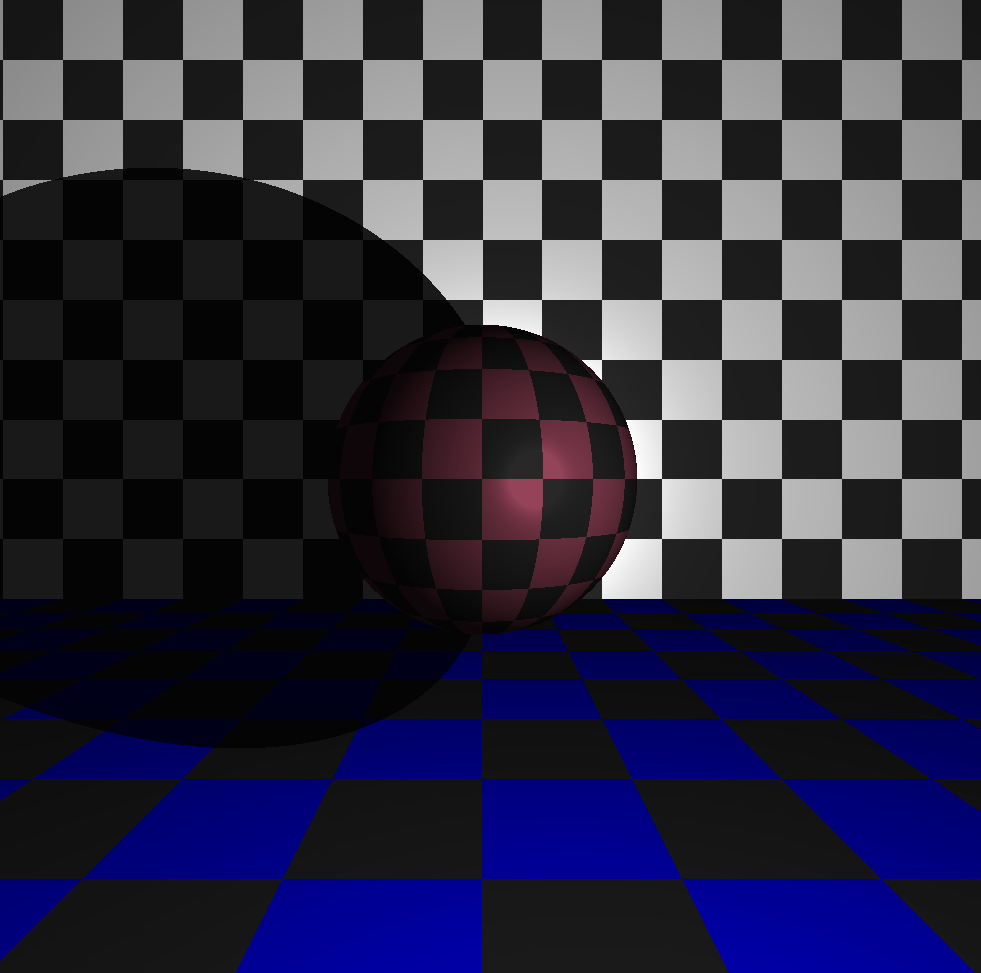
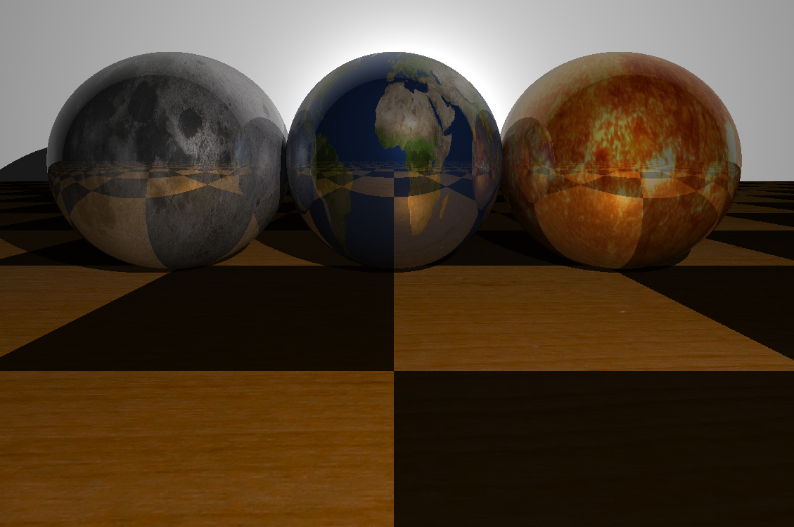
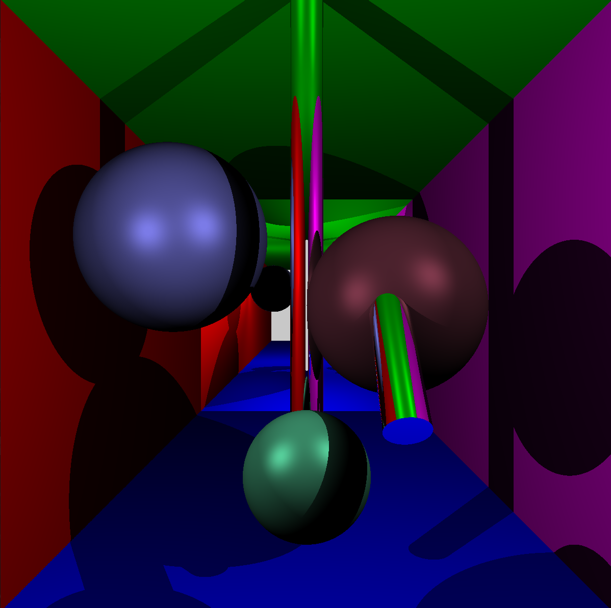
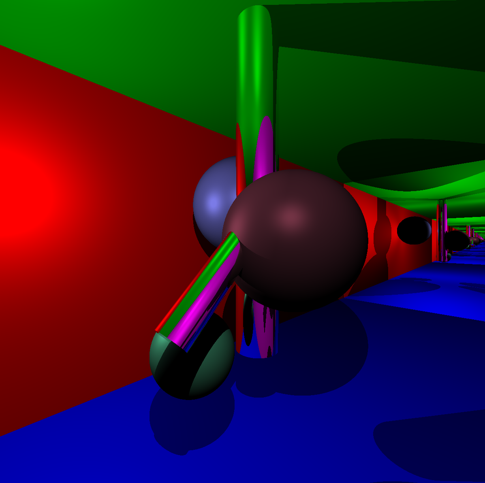
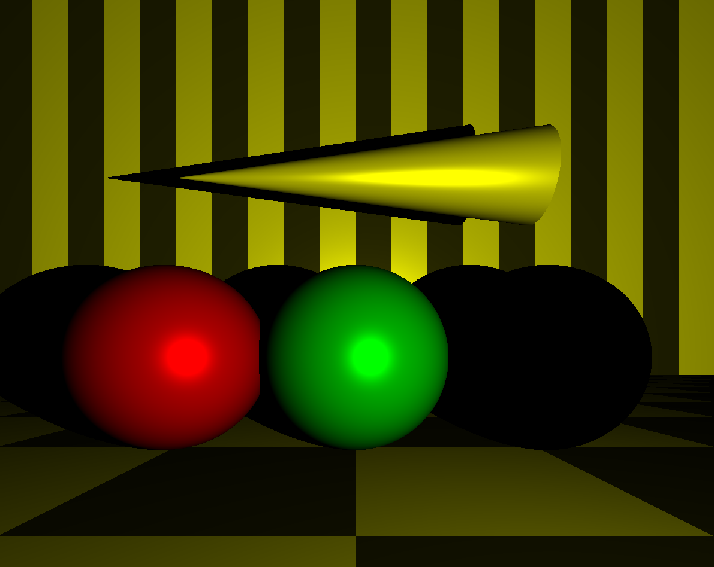
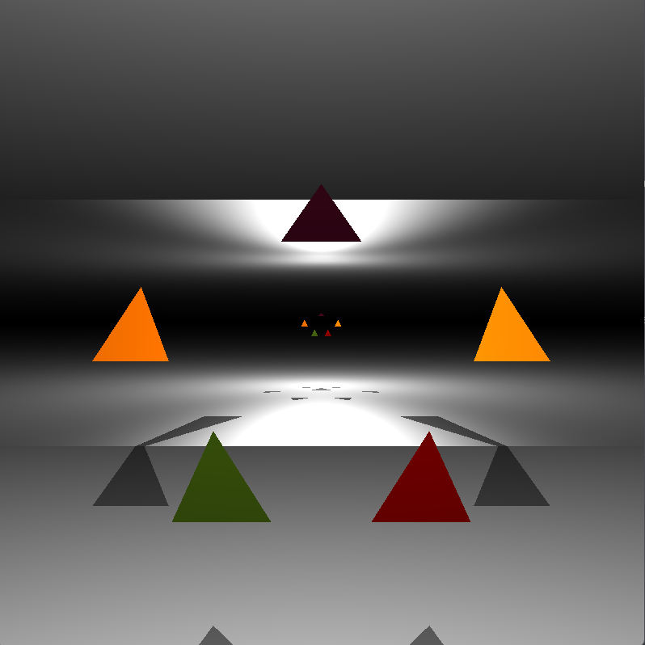
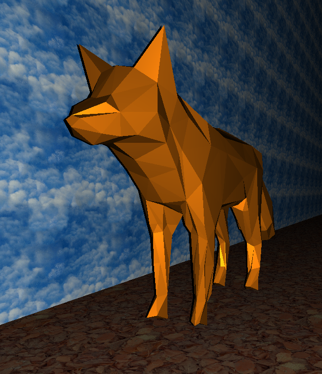
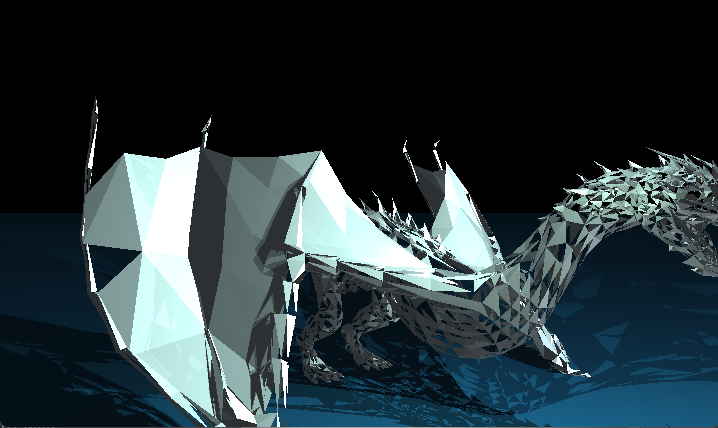
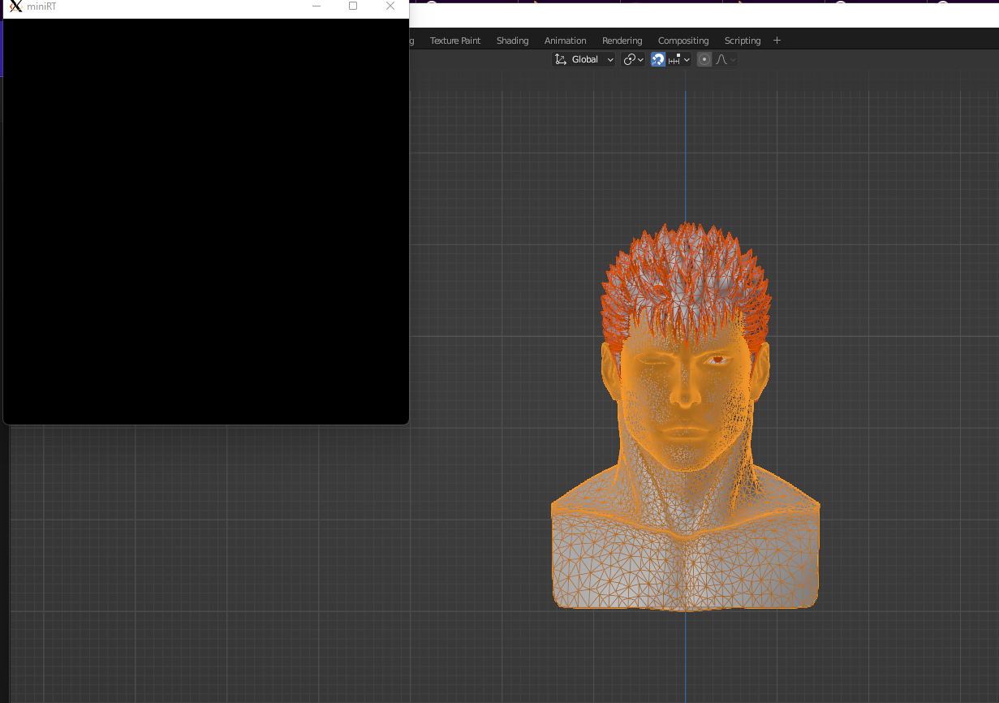
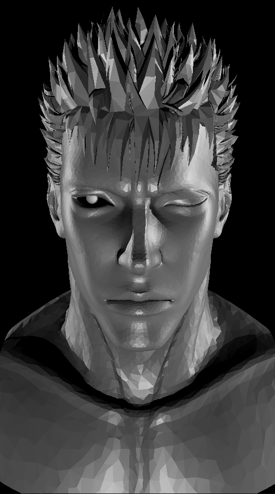

# miniRT
project made with --> ple-lez "https://github.com/ple-lez"

This project is an introduction to ray tracing.
The goal is to be able to display geometric shapes such as spheres, cylinders, planes, and cones. Handle shadow, reflection, texture, fov.

Once the triangles are created, we can have some fun.

We can retrieve objects created in Blender, then by triangulating them, we can obtain the coordinates of the triangles in an STL file.

