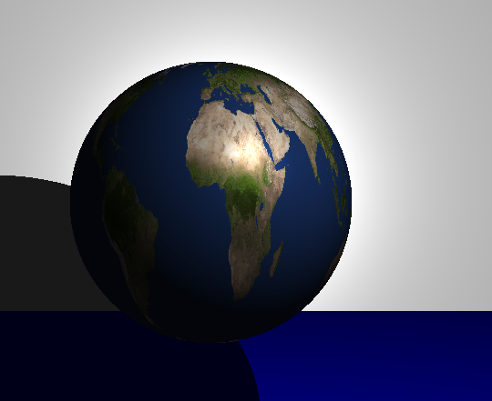

# miniRT
project made with --> ple-lez "https://github.com/ple-lez"

This project is an introduction to ray tracing.
The goal is to be able to display geometric shapes such as spheres, cylinders, planes, and cones. 
Handle shadow, reflection, texture, and more.

